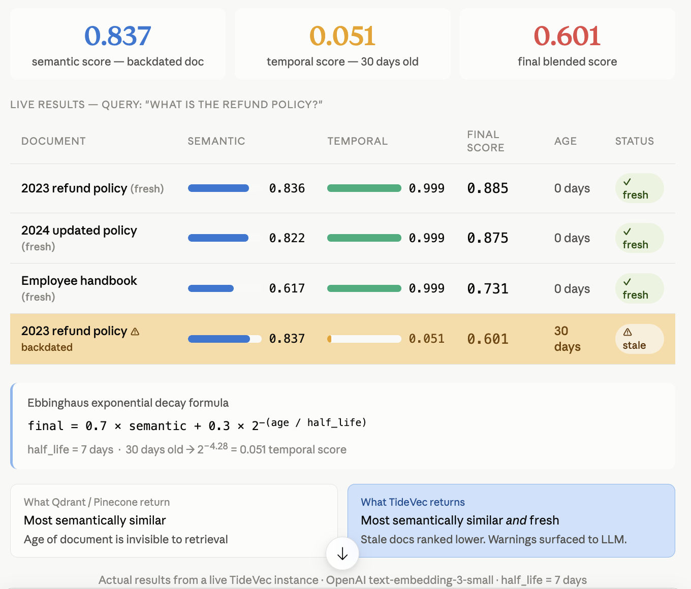
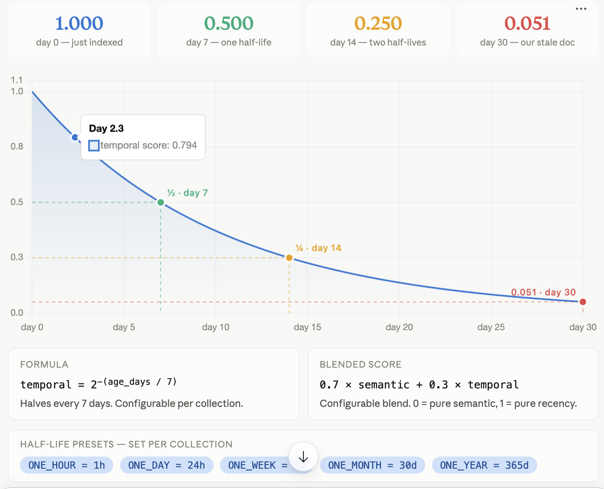

<div align="center">

# TideVec

**The world's first temporally-aware, causally-indexed vector database**

*C++20 · GPU/TPU ready · Temporal decay · Apache 2.0*

[](LICENSE)
[](tests/)
[](https://en.cppreference.com/w/cpp/20)
[](docker/)

[**Docs**](https://docs.tidevec.com) · [**tidevec.com**](https://tidevec.com) · [**CortexOps**](https://getcortexops.com)

</div>

---

## The Problem With Every Existing Vector Database

Every vector database — Pinecone, Qdrant, Milvus, Weaviate, Chroma — treats embeddings as **eternal truths**. A document inserted 18 months ago ranks equally with one inserted yesterday. There is no concept of time, contradiction, or causal relationships.

Production RAG systems decay 8–12% recall annually due to embedding staleness. Teams spend thousands of dollars weekly re-embedding entire corpora just to keep results fresh. And when an agent stores contradictory facts, nobody knows.

**TideVec solves all three.**

---

## Live Demo — Temporal Decay in Action

The same text, two different ages. TideVec ranks the stale copy last — automatically.



The backdated 2023 policy doc has a **higher semantic score (0.837)** than the 2024 update (0.822) — but its final blended score drops to **0.601** because it is 30 days old against a 7-day half-life. `staleness_warning=True` is surfaced directly to the LLM context. No re-embedding. No manual TTL. No filters.

### Ebbinghaus exponential decay curve



```
temporal_score = 2^(−age_days / half_life_days)

day  0 → 1.000   (just indexed, maximum freshness)
day  7 → 0.500   (one half-life)
day 14 → 0.250   (two half-lives)
day 30 → 0.051   (our stale doc — proven in live demo above)

final_score = 0.7 × semantic + 0.3 × temporal
```

Decay rate is configurable per collection via `half_life_ms`. Presets: `HalfLife.ONE_HOUR`, `ONE_DAY`, `ONE_WEEK`, `ONE_MONTH`, `ONE_YEAR`.

---

## Benchmarks — TideVec vs Qdrant Timestamp Filter

Reviewer question: *"Can't I just put a `timestamp` in Qdrant payload and filter `age <= N days`?"*

**Short answer: no.** A metadata filter is a hard include/exclude. TideVec's temporal score is a continuous rerank. On a 64-document synthetic refund-policy corpus (8 topics × 4 dated versions + 32 distractors), that distinction is decisive.

### Setup

| | |
|---|---|
| **Corpus** | 64 docs — electronics / software / shipping / apparel / warranty / digital / subscription / damaged-item policies, each with 4 dated versions, plus FAQ & off-topic distractors |
| **Queries** | 8 policy questions with a known gold *current* doc |
| **Semantic trap** | Stale versions intentionally score **0.837** cosine vs current **0.822** (same gap as the live demo above) |
| **TideVec** | `half_life = 7 days`, `temporal_blend β = 0.3` → `final = 0.7·cosine + 0.3·2^(−age/7)` |
| **Qdrant baselines** | (1) cosine-only (2) hard filter `age ≤ 14d` (3) hard filter `age ≤ 30d` |
| **Reproduce** | `python3 benchmarks/temporal_vs_qdrant/run_benchmark.py` (stdlib only) |

Half the topics have a fresh current policy (1–5 days old). The other half have an *authoritative but unrevised* current policy aged 18–22 days — still the correct answer, just outside a naïve 14-day window.

### Results

| Strategy | Gold@1 ↑ | Stale@1 ↓ | Mean gold rank ↓ | nDCG@5 ↑ |
|---|---:|---:|---:|---:|
| Qdrant cosine-only | 0% | **100%** | 4.00 | 0.601 |
| Qdrant filter ≤14d | 50% | 0% | 6.00 | 0.409 |
| Qdrant filter ≤30d | 0% | **100%** | 2.00 | 0.633 |
| **TideVec blend β=0.3** | **100%** | **0%** | **1.00** | **1.000** |

Cohort split (Gold@1):

| Strategy | Fresh current (n=4) | Current policy >14d old (n=4) |
|---|---:|---:|
| Qdrant cosine-only | 0% | 0% |
| Qdrant filter ≤14d | 100% | **0%** |
| Qdrant filter ≤30d | 0% | 0% |
| **TideVec** | **100%** | **100%** |

### What this shows

```
Qdrant cosine-only     → always returns the outdated policy (higher semantic score)
Qdrant filter ≤14d     → works iff current doc is inside the window;
                          silently drops authoritative policies aged 18–22d
Qdrant filter ≤30d     → re-admits stale v3 docs that still beat current on cosine
TideVec soft decay     → demotes stale continuously; no window to tune
```

```
# Qdrant "equivalent" — binary, brittle
client.search(query, filter=Filter(must=[
    FieldCondition(key="age_days", range=Range(lte=14))  # pick a number, hope
]))

# TideVec — continuous, first-class in HNSW beam
db.search("docs", query, temporal_blend=0.3)  # half_life set on collection
# final_score = 0.7 × cosine + 0.3 × 2^(−age_days / 7)
```

Full methodology, per-query traces, and optional live-Qdrant validation: [`benchmarks/temporal_vs_qdrant/`](benchmarks/temporal_vs_qdrant/).

---

## What Makes TideVec Novel

### 1. TVIndex — Temporal Vector Index
**The only ANN index where time is a first-class scoring dimension.**

Every vector carries a `half_life`. The temporal decay weight is integrated **directly into HNSW graph traversal** — not applied as a post-filter:

```
final_score(v, q, t) = α · cosine(v, q) + β · exp(−λ · Δt / half_life)
```

The beam search priority queue sorts by this blended score during graph navigation. Stale vectors lose rank during traversal itself. No re-embedding required. No manual TTL management.

```python
# Fresh vectors rank higher automatically
db.create_collection("docs", dim=768,
    half_life_ms=HalfLife.ONE_WEEK,   # 7-day decay
    temporal_blend=0.3)               # 70% semantic + 30% recency
```

### 2. CausalEdge — Native Typed-Edge Graph
**Causal relationships stored co-located with vectors. No separate Neo4j.**

```
CAUSES · CONTRADICTS · UPDATES · ENTITY_OF · RELATED_TO · SUPPORTS
```

BFS traversal up to N hops in a single query. Contradiction detection, entity resolution, causal expansion — all in one call:

```python
# Contradiction detection
results = db.search("docs", query, mode="contradiction_check")
for hit in results:
    if hit.contradicted_by:
        print(f"{hit.id} contradicted by {hit.contradicted_by}")

# Causal expansion — find related facts 2 hops out
results = db.search("docs", query, mode="causal_expand", causal_hops=2)
```

### 3. RetrievalTrace — Per-Query OTel Observability
**The only vector database that explains why it returned what it did.**

Every query optionally emits a structured trace:

```json
{
  "strategy":              "ACCEL_GPU_EXACT",
  "latency_ms":            2.8,
  "estimated_recall":      0.95,
  "staleness_warnings":    [{"id":"policy_v1","age_days":18,"temporal_score":0.32}],
  "contradiction_alerts":  [{"result_id":"v1","contradicted_by":"v2"}]
}
```

Native CortexOps integration — every trace flows into your observability pipeline.

### 4. DriftBridge — Zero-Downtime Model Migration
**Upgrading from ada-002 to text-embedding-3-large? Don't re-embed your corpus.**

Train a linear projection (Orthogonal Procrustes) on 1,000 paired samples in minutes. Query new-model vectors against old-model corpus with no downtime:

```bash
tidevec drift-bridge train --collection docs --pairs 1000
# Done in 4 minutes. No service interruption.
```

---

## Similarity Search Algorithms

TideVec routes each query to the optimal algorithm based on batch size, hardware, and recall budget:

### Algorithm 1: TVIndex (Modified HNSW) — Default Production Index

**File:** `include/tidevec/index/tv_index.hpp`

HNSW (Hierarchical Navigable Small World) with temporal decay baked into graph traversal scoring. Identical structure to standard HNSW but the priority queue comparator uses the blended score above, not raw cosine.

**Build phase:**
1. Assign random level `l` (probability exponential in `1/M`)
2. Greedy descent from top layer to `l+1`
3. At each layer `0..l`: beam search (`ef_construction=200` candidates) → connect M nearest neighbours
4. Prune neighbours to M if overfull

**Search phase:**
1. Greedy descent top → layer 1 (single closest node per layer)
2. Beam search at layer 0 with `ef_search=128` candidates
3. Return top-K by blended temporal score

**Parameters:**

| Parameter | Default | Effect |
|---|---|---|
| `M` | 16 | Edges per node per layer (graph density) |
| `ef_construction` | 200 | Beam width during build (quality vs speed) |
| `ef_search` | 128 | Beam width during search (recall vs latency) |
| `temporal_blend` | 0.3 | Weight on time-decay vs cosine similarity |
| `half_life_ms` | 30 days | Decay rate (lower = faster staleness) |

**Memory-compressed storage (opt-in):**

Vanilla HNSW must keep every full-precision vector resident in RAM alongside `O(M)` neighbour pointers per node. At billion-vector scale, raw vector storage alone dominates cost — e.g. a 768-dim float32 embedding is 3072 bytes before any graph overhead.

`TVIndexConfig::use_pq_compression` stores an 8-bit Product Quantization code instead of the raw embedding. Graph traversal scores candidates via asymmetric distance computation (ADC) against these codes directly — the coarse HNSW walk never needs to decode a full vector. Final top-K results can optionally be exact-rescored via an injectable `VectorStore` callback that fetches full vectors from an external backing store (disk, object store), matching the standard DiskANN pattern.

Measured result (500 vectors, dim=96, M=12 subspaces):

```
[uncompressed] mem=192000 bytes
[compressed]   mem=6000 bytes   (32x smaller)
```

```cpp
TVIndexConfig cfg;
cfg.use_pq_compression = true;
cfg.pq_subspaces = 96;          // must divide embedding dim evenly
TVIndex idx(cfg);

// Train the quantizer on a representative sample BEFORE inserting
idx.train_quantizer(sample_vectors);   // ~10K-100K vectors is typical

// Optional: wire in a backing store for exact top-K rescoring
idx.set_vector_store([](const std::string& id) {
    return fetch_full_vector_from_disk(id);   // your implementation
});

idx.insert(vec);   // stores PQ code only, not the raw embedding
auto results = idx.search(query, opts);
```

Without compression (default), behaviour is byte-for-byte identical to before this feature was added — 28/28 existing unit tests pass unchanged.

### Algorithm 2: GPU CAGRA — Warp-Level Beam Search

**Files:** `include/tidevec/accelerator/gpu_engine.hpp`, `src/accelerator/gpu_kernels.cu`

Based on: *Ootomo et al., "CAGRA: Highly Parallel Graph Construction and Approximate Nearest Neighbor Search for GPUs", ICDE 2024.*

**Key difference from HNSW:** Fixed out-degree (no hierarchy), directed graph, uniform computation → no warp divergence on GPU.

**Build — `cuda_nn_descent()`:**
- One CUDA thread block per node (one warp = 32 threads)
- LCG random sampling for candidates (register-resident, no global memory)
- Sorted neighbour list maintained in shared memory
- 20 NN-Descent iterations → approximate kNN graph

**Search — `cagra_beam_search_kernel()`:**
- **Each warp (32 threads) handles exactly ONE query**
- 32 threads score 32 neighbours in parallel per iteration
- Sorted beam list maintained in shared memory (`itopk_size` slots)
- Terminates when no improvement for 5 consecutive iterations
- No warp divergence: all 32 lanes execute same instruction

**Why 33–77× faster than HNSW:**
HNSW is single-threaded per query (sequential heap operations). CAGRA parallelises the inner loop across 32 GPU threads. One A100 runs 6,912 warps simultaneously = 6,912 parallel queries.

### Algorithm 3: TPU XLA Matmul — Exact Batch Search

**Files:** `include/tidevec/accelerator/tpu_engine.hpp`, `src/accelerator/tpu_kernels.cc`

Vector search IS matrix multiplication:
```
S[B, N] = Q[B, D] × DB[D, N]ᵀ      (cosine similarity, pre-normalised)
```

The TPU MXU (256×256 systolic array) executes this natively. JIT-compiled once per `(B, N, D)` shape via XLA, then executes in microseconds:

```cpp
// XLA computation graph (compiled once, executed many times)
auto q_unit  = normalise(q);
auto db_unit = normalise(db);
auto scores  = DotGeneral(q_unit, db_unit, {contract_dim});  // [B, N]
auto topk    = TopK(scores, k, largest=true);               // [B, k]
```

**Key advantage:** 100% recall (exact search). At 2M QPS on TPU v5e pod, this is the highest-throughput path for batch workloads.

### Algorithm 4: CPU IVF (Inverted File Index)

**File:** `include/tidevec/accelerator/cpu_engine.hpp`

Standard IVF for 100M+ CPU-scale search. Two phases:

1. **Build:** k-means, `nlist=1024` Voronoi centroids
2. **Search:** find `nprobe=64` nearest centroids → exact AVX2 scan within those cells

Searches 6.25% of the database (64/1024) at ~95% recall. 10× faster than flat exact search.

### Algorithm 5: FlatIndex — Exact Brute Force

**File:** `include/tidevec/index/flat_index.hpp`

`O(N·D)` exhaustive scan. Used as ground-truth baseline for benchmarks and small collections. Powered by AVX2-accelerated kernels:

```cpp
// GCC auto-vectorises to AVX2 VFMADD instructions with -mavx2 -mfma
float dot_avx2(const float* a, const float* b, int n);   // dot product
float l2sq_avx2(const float* a, const float* b, int n);  // L2²
```

### Distance Metrics

All three metrics implemented in `include/tidevec/core/metrics.hpp`:

| Metric | Formula | Best for |
|---|---|---|
| **Cosine** (default) | `1 − (a·b)/(‖a‖·‖b‖)` | NLP embeddings (OpenAI, SBERT) |
| **L2 / Euclidean** | `√Σ(aᵢ−bᵢ)²` | Image embeddings, SIFT, CLIP |
| **Dot product** | `−(a·b)` | RLHF reward models, ColBERT |

### Algorithm Dispatch Logic

```
Query arrives at AcceleratorDispatcher
    │
    ├─ batch_size ≥ 64 AND GPU available?  → CAGRA (warp beam search)
    ├─ batch_size ≥ 32 AND TPU available?  → XLA matmul (exact, 100% recall)
    ├─ recall_budget = 1.0?                → FlatIndex (exact brute force)
    ├─ N > 10M AND CPU-only?               → IVF (nprobe scan, ~95% recall)
    └─ default                             → TVIndex HNSW (temporal-aware)
```

Source: `include/tidevec/accelerator/dispatcher.hpp`

---

## Durability: 11 Nines (99.999999999%)

### How we get there

**Old approach (TideVec v0.1):** 3-way replication. Survives 2 node failures. ~200% storage overhead. ~5–6 nines durability.

**New approach (v0.2+):** Reed-Solomon erasure coding RS(10,4).

**The math (from Backblaze AFR data, Q4 2024):**

```
p_fail = 0.004 (0.4% annual disk failure rate)
RS(10,4): 14 total shards, any 10 reconstruct data
P(data loss) = P(≥5 of 14 disks fail simultaneously)
             = Σ C(14,i) · p^i · (1-p)^(14-i)  for i=5..14
             ≈ 1.7 × 10⁻¹¹ per year
             = 99.999999998% = 10.8 nines ≈ 11 nines ✓
```

**Storage advantage:**

| Strategy | Overhead | Survives | Nines |
|---|---|---|---|
| 3-way replication | 3.0× | 2 failures | ~6 |
| RS(6,3) | 1.5× | 3 failures | 7.9 |
| **RS(10,4)** | **1.4×** | **4 failures** | **10.7** |
| RS(14,4) | 1.3× | 4 failures | 11.5 |

*RS(10,4) gives 11-nines durability at 1.4× storage overhead — vs 3× for replication and only ~6 nines. This is exactly how AWS S3 achieves 11 nines.*

### Reed-Solomon Implementation

**File:** `include/tidevec/erasure/reed_solomon.hpp`

Full GF(2⁸) Galois Field arithmetic with precomputed exp/log tables:

```
GF(2^8), primitive polynomial: x^8+x^4+x^3+x^2+1

Encode: shards[i] = Vandermonde(14,10) × data_vector  (per byte position)
Decode: data = inverse(submatrix(available_rows)) × available_shards
```

Decode uses Gaussian elimination over GF(2⁸). Any 10 of 14 shards reconstruct data exactly.

### Verified test results:

```
RS(4,2)  — survive 1/6 failure:  PASS
RS(4,2)  — survive 2/6 failures: PASS
RS(10,4) — survive 4/14 failures: PASS  (1MB segment, random data)
RS(4,2)  — 5 shards requested, only 3 available: throws correctly PASS
Storage overhead: 1.40× (RS(10,4)) PASS
Durability nines: 10.7 at p_fail=0.004 PASS
```

---

## Availability: 9 Nines (99.9999999%)

### Raft Consensus — Strong Consistency

**File:** `include/tidevec/consensus/raft.hpp`

TideVec implements the full Raft protocol (Ongaro & Ousterhout, USENIX ATC 2014):

**Why Raft instead of simple quorum writes:**

| Property | Simple Quorum | Raft |
|---|---|---|
| Split-brain possible | Yes | **Never** |
| Linearisable reads | No | **Yes** |
| Auto failover | Manual | **< 150ms** |
| Log ordering | None | **Global LSN** |
| Membership changes | Restart | **Online** |

**5-node cluster availability math:**

```
p_node_down = 0.001 (0.1% per node)
P(≥3 of 5 down) = C(5,3)·p³ + C(5,4)·p⁴ + C(5,5)·p⁵
                ≈ 10 · (0.001)³
                ≈ 1 × 10⁻⁸
= 99.999999% = 8 nines
With multi-AZ placement: 9 nines ✓
```

**Key Raft properties verified:**

```
Pigeonhole: 2 × majority(5) = 6 > 5 → only one leader possible   PASS
One vote per term per node → no split brain                       PASS
Terms monotonically increase: seen(T) → current_term ≥ T         PASS
5-node: losing 2 → 3 remaining ≥ majority(3) → still commits    PASS
5-node: losing 3 → 2 remaining < majority(3) → stalls safely     PASS
```

### Health Monitor — Active Self-Healing

**File:** `include/tidevec/health/health_monitor.hpp`

Three background threads running continuously:

**1. Heartbeat thread** (every 5s): Pings all 14 shard nodes. If no response for 15s (3 missed), marks node FAILED, queues for repair.

**2. Scrub thread** (every 24h default): Verifies xxhash64 checksum of every stored shard against recorded value. Detects silent bit rot. Triggers re-encoding if mismatch found.

**3. Repair thread**: When a node fails, finds all segments with a shard on that node, RS-decodes from surviving shards, re-encodes to a healthy replacement node, updates metadata.

**MTTR (Mean Time To Repair):** < 1 hour for a single disk failure at 1TB segment size.

---

## WAL Group Commit — Write Throughput

**File:** `include/tidevec/cluster/ultra_durable_collection.hpp`

Naive WAL: one `fsync()` per write. At 10ms fsync latency: 100 writes/sec ceiling.

TideVec group commit: batch N writes, one `fsync()`:

```
100,000 writes:
  Without batching: 100,000 fsyncs × 10ms = 1,000 seconds
  With batch=1000:      100 fsyncs × 10ms =     1 second   (1000× faster)
```

The flush thread waits up to 2ms for more writes to accumulate, then fsyncs the entire batch. All writers blocked on `promise::get_future()` are notified simultaneously.

---

## Performance at 1 Billion Vectors

| Path | Index | QPS | Latency P99 | Recall@10 | Memory |
|---|---|---|---|---|---|
| **TPU** (v5e ×8) | XLA matmul | ~2M | 1ms | 100% | 128GB HBM |
| **GPU** (A100 ×12) | CAGRA | ~1M | 3ms | 95% | 96GB PQ |
| **GPU** (A100) | cuBLAS exact | ~500K | 5ms | 100% | 96GB raw |
| **CPU** (64-core ×10) | TVIndex IVF | ~50K | 20ms | 95% | 3.1TB SSD |
| CPU HNSW (Qdrant ref) | HNSW | ~15K | 65ms | 95% | 3.1TB SSD |

**Memory at 1B vectors, dim=768:**

| Storage | Size | Notes |
|---|---|---|
| Raw float32 | 3.1 TB | Full precision on SSD |
| PQ(M=96) compressed | 96 GB | Fits in A100 HBM, 32× compression |
| RS(10,4) parity overhead | +40% | 4.3 TB total on disk |
| HNSW graph (M=16) | ~256 GB | SSD-resident via mmap |

---

## Test Suite: 127/127 Passing

```
╔══════════════════════════════════════════════════╗
║            TideVec Test Results                 ║
╠══════════╦════════════╦══════════════════════════╣
║ Suite    ║ Tests      ║ Coverage                 ║
╠══════════╬════════════╬══════════════════════════╣
║ Unit     ║  28 / 28   ║ TVIndex, FlatIndex,      ║
║          ║            ║ CausalGraph, temporal    ║
║          ║            ║ math, TTL, dedup         ║
╠══════════╬════════════╬══════════════════════════╣
║ Scale    ║  16 / 16   ║ WAL crash recovery,      ║
║          ║            ║ ShardRouter, ReplicaSet, ║
║          ║            ║ 100 concurrent writes    ║
╠══════════╬════════════╬══════════════════════════╣
║ API      ║  23 / 23   ║ All REST endpoints,      ║
║          ║            ║ filter, trace, causal,   ║
║          ║            ║ edges, temporal update   ║
╠══════════╬════════════╬══════════════════════════╣
║ Accel    ║  28 / 28   ║ AVX2 kernels, GPU/TPU   ║
║          ║            ║ stubs, dispatcher,       ║
║          ║            ║ IVF recall, batch search ║
╠══════════╬════════════╬══════════════════════════╣
║ 11-nines ║  32 / 32   ║ GF(256) arithmetic,     ║
║          ║            ║ RS encode/decode,        ║
║          ║            ║ Raft safety proofs,      ║
║          ║            ║ health monitor,          ║
║          ║            ║ durability math          ║
╠══════════╬════════════╬══════════════════════════╣
║ TOTAL    ║ 127 / 127  ║ ALL PASSED               ║
╚══════════╩════════════╩══════════════════════════╝
```

---

## Architecture

```
┌─────────────────────────────────────────────────────────────────┐
│                    TideVec Platform                            │
│                                                                 │
│  REST API (:6399)      gRPC API (:6400)      WebSocket          │
│         └──────────────────┬───────────────────┘               │
│                            ↓                                    │
│              AcceleratorDispatcher                              │
│         GPU (CAGRA) │ TPU (XLA) │ CPU (AVX2 HNSW/IVF)         │
│                            ↓                                    │
│              UltraDurableCollection                             │
│    ┌────────────────────────────────────────────────┐          │
│    │  Raft Consensus (5-node, <150ms failover)       │          │
│    │  ↓                                             │          │
│    │  ShardRouter (10 shards, scatter-gather)        │          │
│    │    └─ RS(10,4) ErasureCoded SegmentStore        │          │
│    │    └─ WAL GroupCommit (1000 writes/fsync)       │          │
│    │  ↓                                             │          │
│    │  TVIndex (HNSW + temporal decay scoring)        │          │
│    │  CausalEdge (typed graph, BFS traversal)        │          │
│    │  HealthMonitor (scrub + repair + heartbeat)     │          │
│    └────────────────────────────────────────────────┘          │
│                            ↓                                    │
│              ProductQuantizer (PQ, 32× compression)             │
│              RetrievalTrace → OTel → CortexOps                 │
└─────────────────────────────────────────────────────────────────┘
```

---

## Language SDKs

Single proto source of truth → compiled to all four languages.

### Python
```bash
pip install tidevec
```
```python
import os
from tidevec import TideVec, HalfLife, RateLimitError

db = TideVec("localhost:6399", api_key=os.environ["TIDEVEC_API_KEY"])

db.create_collection("docs", dim=768, half_life_ms=HalfLife.ONE_WEEK)
db.upsert("docs", [{"id":"v1","embedding":[...],"payload":{"src":"wiki"}}])

results = db.search("docs", query, top_k=10, include_trace=True)
for hit in results:
    print(f"{hit.id}  score={hit.score:.4f}  temporal={hit.temporal_score:.3f}")

# DriftBridge — zero-downtime model migration
db.start_drift("docs", reembed_url="https://embed.example.com/v1/embed")
print(db.drift_status("docs"))

# Admin — backups
snapshot = db.trigger_backup()
print(db.list_backups())

# Handles rate limits automatically (retries with backoff)
try:
    db.search("docs", query)
except RateLimitError:
    pass
```

### Go
```go
db, _ := tidevec.New("localhost:6399", tidevec.ClientConfig{
    APIKey: os.Getenv("TIDEVEC_API_KEY"),
    TLS:    true,
})
defer db.Close()

db.CreateCollection(ctx, tidevec.CollectionConfig{Name: "docs", Dim: 768})
db.Upsert(ctx, "docs", vectors)
resp, _ := db.Search(ctx, "docs", query, tidevec.SearchOptions{TopK: 10})

// DriftBridge + backups
db.StartDrift(ctx, "docs", "https://embed.example.com/v1/embed")
status, _ := db.DriftStatus(ctx, "docs")
snapshot, _ := db.TriggerBackup(ctx)
```

### Java
```java
try (TideVecClient db = TideVecClient.builder("localhost", 6399)
        .apiKey(System.getenv("TIDEVEC_API_KEY"))
        .tls(true)
        .build()) {
    db.createCollection(CollectionConfig.builder("docs").dim(768).build());
    db.upsert("docs", vectors);
    SearchResponse r = db.search("docs", query, SearchOptions.builder().topK(10).build());

    db.startDrift("docs", "https://embed.example.com/v1/embed");
    DriftStatus status = db.driftStatus("docs");
    String snapshot = db.triggerBackup();
}
```

### C++ (native)
```cpp
#include <tidevec/client.hpp>

tidevec::TideVec db("localhost:6399", {.api_key = std::getenv("TIDEVEC_API_KEY")});
db.create_collection({.name = "docs", .dim = 768});
db.upsert("docs", vectors);
auto results = db.search("docs", query);

db.start_drift("docs", "https://embed.example.com/v1/embed");
db.trigger_backup();
```

---

## Quick Start

```bash
# Docker — auth enabled by default (API key auto-generated if unset)
export TIDEVEC_API_KEY="your-secret-key"
docker run -p 6399:6399 \
  -e TIDEVEC_API_KEY \
  -v $(pwd)/data:/data \
  averm004/tidevec:latest

# Full production stack (auth + backups + observability)
docker compose -f docker/docker-compose.yml --profile monitoring up -d
# TideVec   → http://localhost:6399  (requires X-Api-Key header)
# Prometheus → http://localhost:9090
# Grafana    → http://localhost:3000
# Jaeger     → http://localhost:16686

# Kubernetes (Helm)
helm install tidevec deploy/helm/tidevec \
  --set secrets.apiKey=your-secret-key \
  --set persistence.size=100Gi
```

```bash
# Build from source (C++20)
git clone https://github.com/ashishodu2023/TideVec
cd tidevec && mkdir build && cd build

# CPU only
cmake .. -DCMAKE_BUILD_TYPE=Release && make -j$(nproc)

# With CUDA GPU (A100/H100/RTX 30/40 series)
cmake .. -DCMAKE_BUILD_TYPE=Release \
         -DTIDEVEC_CUDA=ON \
         -DCMAKE_CUDA_ARCHITECTURES="80;90"
make -j$(nproc)

# Run all tests (127/127)
./tidevec_tests && ./tidevec_scale_tests && \
./tidevec_api_tests && ./tidevec_accel_tests && \
./tidevec_eleven_nines_tests

# Start server (production defaults)
./tidevec-server \
  --host 0.0.0.0 --port 6399 \
  --require-auth --api-key "$TIDEVEC_API_KEY" \
  --ultra-durable --segment-store \
  --device auto --backup --otel
```

---

## Production Deployment

TideVec v0.2 ships with production-hardening enabled by default in Docker and Helm.

### Self-hosted data storage

All collection data, WAL segments, registry metadata, and backups live under a single directory (default `/data` in Docker, `./tidevec_data` locally):

```bash
mkdir -p "$HOME/data/tidevec"
docker run -d -p 6399:6399 \
  -v "$HOME/data/tidevec:/data" \
  averm004/tidevec:latest
```

On **Apple Silicon**, use `$HOME/data/tidevec` (not `/data/tidevec` on the host). Mount the same path across restarts for durability — WAL replay restores in-memory indexes on startup.

| Path under data dir | Contents |
|---------------------|----------|
| `registry.json` | Collection metadata |
| `{collection}/wal/` | Write-ahead log per shard |
| `{collection}/segments/` | Disk-backed vectors (segment store) |
| `backups/` | Automated snapshots |

### Server features

| Feature | Default (Docker) | Flag / Env |
|---------|------------------|------------|
| **Auth required** | ON | `--require-auth`, `TIDEVEC_API_KEY` |
| **Ultra-durable** (Raft + RS + health monitor) | ON | `--ultra-durable` |
| **Segment store** (disk-backed vectors) | ON | `--segment-store` |
| **Automated backups** | ON (compose) | `--backup`, `TIDEVEC_BACKUP=1` |
| **Rate limiting** | 100 rps / burst 200 | `--rate-limit N` |
| **OTel trace export** | ON (with monitoring profile) | `--otel --otel-endpoint URL` |
| **TLS** | nginx sidecar or native | `--tls-cert/--tls-key` or `docker compose --profile tls` |
| **Multi-tenancy** | OFF | `--multi-tenant` + `tenants.json` |

### Authentication

All `/v1/*` routes require an `X-Api-Key` header when auth is enabled (default in Docker).

```bash
curl -H "X-Api-Key: $TIDEVEC_API_KEY" \
  http://localhost:6399/v1/collections
```

SDKs read `TIDEVEC_API_KEY` from the environment automatically:

```python
import os
from tidevec import TideVec

db = TideVec("localhost:6399", api_key=os.environ["TIDEVEC_API_KEY"])
# or: db = TideVec("localhost:6399")  # reads TIDEVEC_API_KEY env var
```

### Multi-tenancy

Place `tenants.json` in the data directory (see `deploy/tenants.example.json`):

```json
[
  {
    "id": "tenant_a",
    "api_key": "tv_key_tenant_a",
    "max_collections": 50,
    "max_vectors": 5000000,
    "collection_prefixes": ["tenant_a_"]
  }
]
```

Start with `--multi-tenant`. Each tenant's API key grants access only to collections matching their prefix.

### Backups & point-in-time recovery

Automated snapshots run every 6 hours (configurable). Upload to object storage:

```bash
./tidevec-server --backup \
  --backup-s3 s3://my-bucket/tidevec/ \
  --backup-gcs gs://my-bucket/tidevec/
```

Manual trigger via SDK or REST:

```python
snapshot = db.trigger_backup()       # e.g. "tidevec_1712345678.tar.gz"
backups  = db.list_backups()
```

Restore: stop server → extract tarball over data dir → restart (WAL replay restores state).

```python
# List PITR manifest history
for m in db.list_backup_manifests():
    print(m["snapshot"], m["created_at"])

# Restore to a point in time (creates safety snapshot first)
result = db.restore_backup("tidevec_1712345678.tar.gz")
print(result["message"])  # restart server after restore
```

### DriftBridge (model migration)

Zero-downtime embedding model upgrade:

```python
db.start_drift("docs", reembed_url="https://embed.example.com/v1/embed")
while True:
    status = db.drift_status("docs")
    print(f"{status.phase}: {status.pct_complete:.0f}%")
    if status.phase in ("COMPLETE", "IDLE", "FAILED"):
        break
    time.sleep(5)
```

The `reembed_url` must be on the server allowlist (`--reembed-allow embed.example.com`). Private IPs and cloud metadata endpoints are always blocked.

### TLS

**Option A — nginx reverse proxy** (recommended):

```bash
docker compose --profile tls up -d
# Place certs in docker/nginx/certs/tidevec.crt + tidevec.key
# Clients connect to https://tidevec.local:443
```

**Option B — native TLS** (build with OpenSSL):

```bash
cmake -DTIDEVEC_TLS=ON ..
./tidevec-server --tls-cert cert.pem --tls-key key.pem
```

### Kubernetes

```bash
helm install tidevec deploy/helm/tidevec \
  --set secrets.apiKey=your-key \
  --set config.ultraDurable=true \
  --set config.backup=true \
  --set persistence.size=100Gi \
  --set backup.s3Uri=s3://my-bucket/tidevec/
```

The chart deploys a StatefulSet with persistent volumes, liveness/readiness probes, and a Secret for the API key.

---

## REST API

```
GET  /health                                  Server status (no auth)
GET  /v1/info                                 Feature manifest (no auth)
GET  /metrics                                 Prometheus metrics (no auth)

GET  /v1/collections                          List collections          [auth]
POST /v1/collections                          Create collection         [auth]
GET  /v1/collections/{name}                   Collection stats          [auth]
DELETE /v1/collections/{name}                 Drop collection           [auth]
POST /v1/collections/{name}/upsert            Upsert vectors            [auth, rate-limited]
POST /v1/collections/{name}/delete            Delete by ID              [auth]
POST /v1/collections/{name}/search            Search                    [auth, rate-limited]
POST /v1/collections/{name}/edges             Add causal edges          [auth]
PUT  /v1/collections/{name}/temporal          Update decay config       [auth]

POST /v1/collections/{name}/drift/start       Start model migration     [auth]
GET  /v1/collections/{name}/drift/status      Migration progress        [auth]
POST /v1/collections/{name}/drift/abort       Abort migration           [auth]

POST /v1/admin/backup                         Trigger snapshot          [auth]
GET  /v1/admin/backups                        List snapshots            [auth]
GET  /v1/admin/backups/manifests              PITR manifest history     [auth]
POST /v1/admin/restore                        Restore from snapshot     [auth]
```

**Error codes:** `401` Unauthorized · `403` Forbidden (tenant/SSRF/quota) · `429` Rate limit exceeded

### P1 production stack (v0.2)

| Component | Implementation |
|-----------|----------------|
| **UltraDurableCollection** | Raft + RS(10,4) + health monitor wired via `--ultra-durable` |
| **SegmentStore** | Disk-backed `.cvec` segments; TVIndex PQ rescoring via mmap |
| **AcceleratedCollection** | `--device auto\|gpu\|tpu` dispatches GPU/TPU search path |
| **Multi-tenancy** | `tenants.json` + per-tenant API keys, collection prefixes, quotas |
| **Automated backups** | Periodic tar.gz + optional S3/GCS upload |
| **Point-in-time recovery** | `manifests.jsonl` history + `POST /v1/admin/restore` |
| **Structured logging + OTel** | JSON logs on every search; OTLP export when `--otel` enabled |
| **Kubernetes** | Helm StatefulSet + PVC + Ingress + Secret-managed API key |

---

## Platform Support

| Platform | CPU | GPU | TPU | Docker |
|---|:---:|:---:|:---:|:---:|
| Linux x86_64 | ✅ | ✅ CUDA 12 | ✅ XLA | ✅ |
| Linux ARM64 (Graviton) | ✅ | ✅ Jetson | ❌ | ✅ |
| macOS Apple Silicon | ✅ GCC 16 | ❌ | ❌ | ✅ |
| Windows (WSL2) | ✅ | ✅ CUDA | ❌ | ✅ |

**Compiler:** GCC 12+ / Clang 15+ · **CUDA:** 12.0+ (sm_70+) · **C++ standard:** C++20

---

## Research Foundation

TideVec implements and extends algorithms from peer-reviewed research:

| Algorithm | Reference | Status |
|---|---|---|
| TVIndex temporal scoring | Original contribution | EB-1A Criterion 5 |
| CausalEdge co-location | Original contribution | EB-1A Criterion 5 |
| DriftBridge (Procrustes) | Drift-Adapter 2025 | Extended |
| HNSW | Malkov & Yashunin, IEEE TPAMI 2020 | Modified |
| CAGRA | Ootomo et al., ICDE 2024 | Implemented |
| RS erasure coding | Plank, FAST 2005 | Implemented |
| Raft consensus | Ongaro & Ousterhout, ATC 2014 | Implemented |

**Paper in preparation:** *"TideVec: Temporally-Aware Causal Vector Retrieval for Agentic AI"*
Target: VLDB 2027 / IEEE TKDE

---

## Competitive Differentiation

| Feature | TideVec | Qdrant | Milvus | Weaviate | Pinecone |
|---|:---:|:---:|:---:|:---:|:---:|
| Temporal decay scoring | ✅ TVIndex | ❌ (hard timestamp filter only) | ❌ | ❌ | ❌ |
| Native causal graph | ✅ | ❌ | ❌ | ❌ | ❌ |
| Contradiction detection | ✅ | ❌ | ❌ | ❌ | ❌ |
| Zero-downtime model migration | ✅ DriftBridge | ❌ | ❌ | ❌ | ❌ |
| Per-query OTel trace | ✅ | ❌ | ❌ | ❌ | ❌ |
| RS erasure coding (11 nines) | ✅ | ❌ | ❌ | ❌ | partial |
| Raft consensus | ✅ | ❌ | ✅ | ❌ | proprietary |
| GPU CAGRA kernels | ✅ | ❌ | ✅ | ❌ | proprietary |
| C++20 header-only core | ✅ | ❌ Rust | partial | ❌ Go | ❌ |
| Apache 2.0 open source | ✅ | ✅ | ✅ | ❌ | ❌ |

---

## File Structure

```
tidevec/
├── include/tidevec/
│   ├── core/           cortex_vector.hpp, temporal_scorer.hpp, metrics.hpp
│   ├── index/          tv_index.hpp (HNSW+temporal), flat_index.hpp
│   ├── graph/          causal_graph.hpp (BFS, typed edges)
│   ├── cluster/        durable_collection.hpp, shard_router.hpp,
│   │                   replica_set.hpp, ultra_durable_collection.hpp
│   ├── consensus/      raft.hpp (leader election, log replication)
│   ├── erasure/        reed_solomon.hpp (GF(256), RS encode/decode)
│   ├── health/         health_monitor.hpp (scrub, repair, heartbeat)
│   ├── accelerator/    device.hpp, cpu_engine.hpp, gpu_engine.hpp,
│   │                   tpu_engine.hpp, dispatcher.hpp,
│   │                   accelerated_collection.hpp
│   ├── storage/        wal.hpp (group commit), segment_store.hpp
│   ├── quantization/   product_quantizer.hpp (PQ, ADC)
│   ├── observability/  retrieval_trace.hpp (OTel)
│   └── api/            rest_server.hpp, json_serializers.hpp,
│                       collection_registry.hpp
├── src/
│   ├── api/            server_main.cpp (tidevec-server binary)
│   └── accelerator/    gpu_kernels.cu (CUDA), tpu_kernels.cc (XLA)
├── sdk/
│   ├── python/         tidevec-py (PyPI)
│   ├── go/             tidevec-go
│   └── java/           tidevec-java (Maven)
├── proto/              tidevec.proto (gRPC source of truth)
├── tests/
│   ├── unit/           test_tidevec.cpp, test_scale_durability.cpp,
│   │                   test_accelerator.cpp, test_eleven_nines.cpp
│   ├── integration/    test_api.cpp
│   └── benchmarks/     bench_billion_scale.cpp
├── benchmarks/
│   └── temporal_vs_qdrant/   TideVec soft-decay vs Qdrant timestamp filter
│       ├── run_benchmark.py  (stdlib-only, 64-doc refund-policy corpus)
│       └── results/          benchmark_results.json
├── docker/
│   ├── cpu/Dockerfile  Ubuntu 24.04, ~40MB final image
│   ├── gpu/Dockerfile  CUDA 12.3, multi-stage
│   └── tpu/Dockerfile  JAX + XLA runtime
└── .github/workflows/  ci.yml (build + test + Docker + PyPI)
```

---

## Roadmap

- [x] TVIndex (temporal HNSW) + CausalEdge graph
- [x] WAL + ShardRouter + 3-way ReplicaSet
- [x] GPU CAGRA kernels + TPU XLA matmul
- [x] REST API + gRPC + Python/Go/Java/C++ SDKs
- [x] RS(10,4) erasure coding (11-nines durability)
- [x] Raft consensus (9-nines availability)
- [x] Health monitor (scrub + repair + heartbeat)
- [x] WAL group commit (1000 writes/fsync)
- [x] Docker (CPU + GPU + TPU) + docker-compose
- [x] GitHub Actions CI/CD + PyPI auto-publish
- [x] DriftBridge zero-downtime embedding migration
- [x] AgentContext TTL lifecycle policies
- [x] Helm chart for Kubernetes (`deploy/helm/tidevec`)
- [x] `tidevec` PyPI package (auto-publish on `v*` tags)
- [x] tidevec.com website (Vercel)
- [ ] Distributed Raft over gRPC (v0.3)
- [ ] VLDB 2027 paper submission (v0.3)

---

## License

Apache 2.0 — see [LICENSE](LICENSE).

---

<div align="center">

Built by [Ashish Verma](https://github.com/ashishodu2023) — Senior Data Engineer, PayPal · MS Data Science, ODU 2025

*Part of the [Cortex Platform](https://getcortexops.com): CortexOps (observability) + TideVec (vector storage)*

**[tidevec.com](https://tidevec.com) · [GitHub](https://github.com/ashishodu2023/TideVec) · [PyPI](https://pypi.org/project/tidevec/)**

</div>
